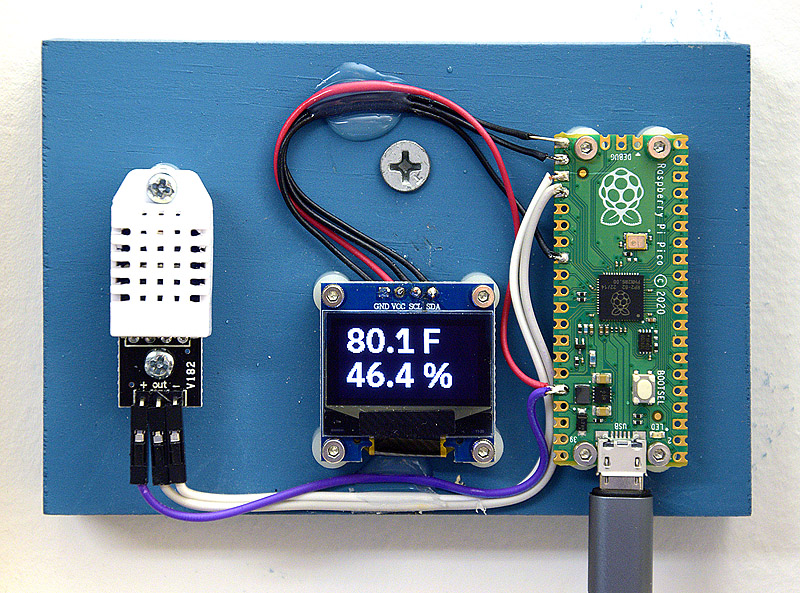

This is a simple demonstration of how to use a Raspberry Pi Pico (programmed in MicroPython)
to sense and display the ambient temperature and humidity, and optionally, also to report
them to a connected PC (Windows, Linux, etc.).

I did this as a simple project to get acquainted with the Pico.  The only thing that is
not obvious is the communication with the PC, which required some thought.

See RPIPico-TempHumiditySensor-README.pdf for further information.
